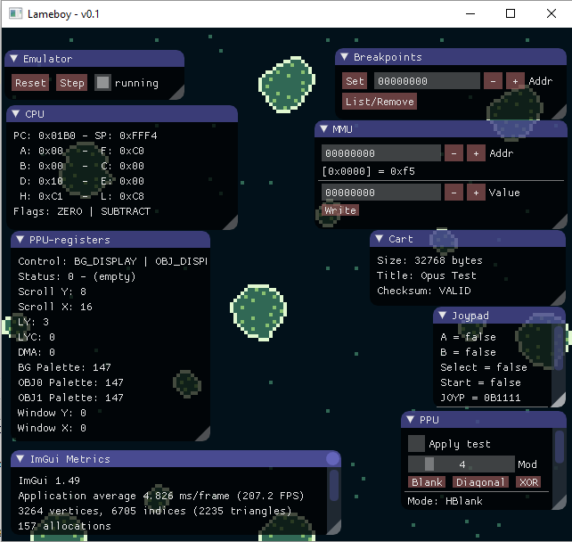
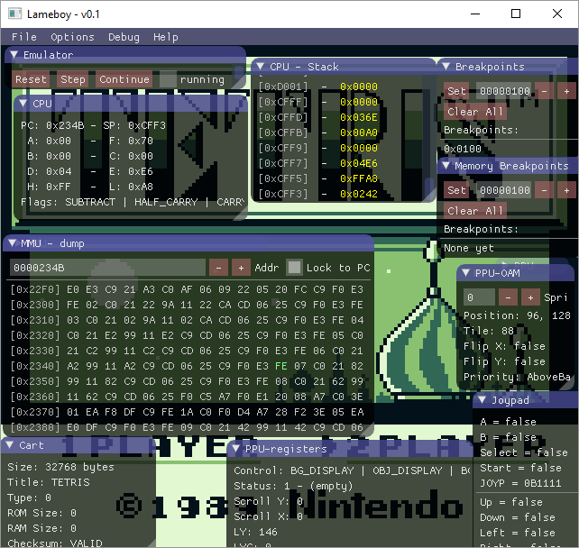

# Lameboy

Yet another Game Boy emulator.

This emulator is a rust learning project for me. It currently isn't aiming to be the most accurate emulator, the fastest
 or the one with the best code. It's just here as something fun for me to play with while learning how to use rust.

## Current Status

Currently just about loads non-MBC roms and has plenty of issues (definitely need to write instruction-level tests).

Plenty of debug windows are implemented which helps track down issues as they come up however.

### TODO

- Fix the many bugs that currently exist
  - Verify all existing instructions work
  - Re-write all the PPU code
- Handle all interrupt types & HALT 
- Handle the construction of the various components better in rust
- Game Boy Color support
- Sound
- Serial support
- Add a decompiler to make memory debugging easier
- Ever more debug windows
